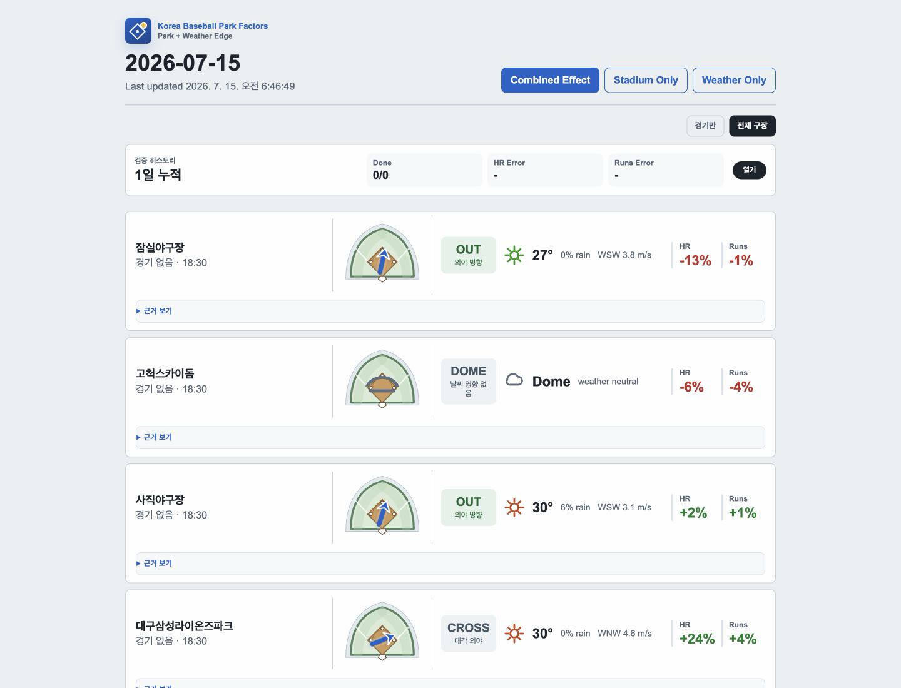
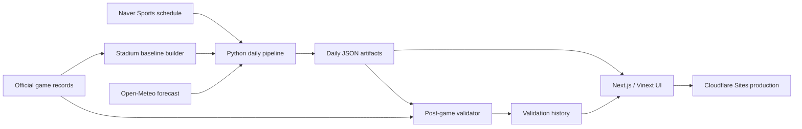

<div align="center">

# Korea Baseball Park Factors

**Daily stadium and weather context for Korea baseball run environments.**<br>
한국 프로야구 경기의 구장 특성과 날씨를 결합해 HR 및 Runs 환경 보정치를 보여주는 데이터 애플리케이션입니다.

[Live Site](https://kbo-park-factors.comon23463.chatgpt.site/) · [Architecture](#architecture--아키텍처) · [Methodology](#methodology--산출-방법) · [Run Locally](#getting-started--로컬-실행)


</div>

[](https://kbo-park-factors.comon23463.chatgpt.site/?show=all)

## What This Project Solves · 해결하려는 문제

Public baseball schedules usually show game time and a short weather forecast, while park-factor references often describe only long-term stadium tendencies. This project connects those two contexts: it estimates how the selected stadium and game-time weather change the home-run and run-scoring environment relative to a neutral baseline.

일반적인 경기 일정은 시간과 간단한 날씨만 보여주고, 구장 효과 자료는 장기적인 구장 성향만 따로 제공하는 경우가 많습니다. 이 프로젝트는 두 정보를 결합해 경기 시각의 구장과 날씨가 중립 환경 대비 홈런과 득점 환경을 얼마나 변화시키는지 한 화면에서 설명합니다.

The values are environmental adjustment estimates, not player projections, betting picks, or guaranteed game outcomes.

표시되는 값은 환경 보정 추정치이며 선수별 예측, 베팅 추천 또는 경기 결과 보장이 아닙니다.

## Core Features · 핵심 기능

| Capability | Implementation |
| --- | --- |
| Daily game context · 일일 경기 정보 | Loads the day's Korea baseball schedule and game-time weather · 당일 경기 일정과 경기 시각의 날씨를 결합합니다. |
| Stadium baseline · 구장 기준값 | Compares stadium HR and Runs rates with league rates and applies sample-size shrinkage · 구장별 HR/Runs 비율을 리그 평균과 비교하고 표본 크기 축소 보정을 적용합니다. |
| Weather adjustment · 날씨 보정 | Uses temperature, pressure, precipitation, wind speed, and wind direction · 기온, 기압, 강수 확률, 풍속, 풍향을 반영합니다. |
| Wind visualization · 바람 시각화 | Projects wind direction against each stadium's field orientation · 구장 방위각을 기준으로 외야·홈·횡풍 방향을 직관적으로 표시합니다. |
| Combined HR/Runs factors · 최종 보정치 | Re-evaluates a neutral batted-ball portfolio under the selected park and weather environment · 중립 타구 포트폴리오를 구장·날씨 환경에서 다시 계산합니다. |
| Post-game validation · 경기 후 검증 | Compares predictions with completed-game home runs and total runs · 종료 경기의 실제 홈런과 총득점으로 예측값을 검증합니다. |
| Production fallback states · 운영 예외 처리 | Handles missing schedules, weather, stadium metadata, and daily artifacts without crashing · 일정, 날씨, 구장 정보, 일일 파일 누락을 명시적인 상태로 처리합니다. |

## Architecture · 아키텍처



The Python pipeline owns ingestion and factor generation. The web layer consumes versioned JSON artifacts, which keeps data collection separate from rendering and makes hosted builds reproducible.

Python 파이프라인이 데이터 수집과 보정치 생성을 담당하고, 웹 계층은 생성된 JSON 산출물을 읽습니다. 수집과 화면 렌더링을 분리해 배포 결과를 재현하기 쉽게 구성했습니다.

## Methodology · 산출 방법

### 1. Schedule and weather · 일정과 날씨

The daily job reads the game schedule from Naver Sports, maps each venue to a local stadium catalog, and selects the nearest Open-Meteo hourly forecast to first pitch in `Asia/Seoul`.

일일 작업은 네이버 스포츠에서 경기 일정을 읽고 구장을 로컬 카탈로그와 연결한 뒤, `Asia/Seoul` 기준 경기 시작 시각과 가장 가까운 Open-Meteo 시간대별 예보를 선택합니다.

### 2. Stadium baselines · 구장 기준값

Completed regular-season games provide each stadium's home runs and total runs per game. Raw factors compare the stadium rate with the league rate. To avoid extreme values from small samples, the project applies a 150-game neutral prior:

```text
raw factor = (stadium rate / league rate - 1) × 100
adjusted factor = raw factor × games / (games + 150)
```

정규시즌 종료 경기의 경기당 홈런과 총득점을 사용합니다. 구장 비율을 리그 비율과 비교한 뒤, 표본이 적은 구장의 값이 과도하게 튀지 않도록 150경기 중립 사전값으로 축소 보정합니다.

### 3. Weather effects · 날씨 효과

Outdoor parks receive rule-based adjustments for temperature, surface pressure, precipitation probability, and wind. Wind direction is converted from where the wind comes from to where it is blowing, then compared with the stadium's center-field orientation. Dome parks keep external weather neutral.

야외 구장은 기온, 지상 기압, 강수 확률, 바람을 반영합니다. 기상 데이터의 풍향을 실제 바람이 향하는 방향으로 변환해 구장 중견수 방향과 비교하며, 돔구장은 외부 날씨 영향을 중립으로 처리합니다.

### 4. Combined factors · 최종 보정치

Park and weather percentages are not simply added. A neutral portfolio of representative contact types is evaluated in the average environment and again in the selected environment. HR, extra-base-hit, and single probabilities are converted to run value, and the percentage change from neutral becomes the displayed factor.

구장 보정치와 날씨 보정치를 단순히 더하지 않습니다. 대표적인 타구 유형으로 구성한 중립 포트폴리오를 평균 환경과 선택 환경에서 각각 계산합니다. 홈런, 장타, 단타 확률을 득점 가치로 환산한 뒤 중립 환경 대비 변화율을 표시합니다.

### 5. Validation · 사후 검증

After games finish, the validator matches predictions with official completed-game records and tracks actual home runs, total runs, pending games, and aggregate error history.

경기 종료 후에는 예측 산출물과 공식 종료 경기 기록을 연결해 실제 홈런, 총득점, 미완료 경기, 누적 오차를 기록합니다.

## Engineering Highlights · 엔지니어링 포인트

- Separated data ingestion, factor calculation, artifacts, UI, and validation into focused modules.
- Bundled daily JSON into the hosted build so the Worker runtime does not depend on a writable filesystem.
- Added explicit fallback states for missing weather, schedules, stadium metadata, and no-game days.
- Added a real game-day smoke path in addition to unit tests for parsers and factor calculations.
- Built a responsive wind/field visualization that uses each stadium's orientation.
- An external scheduled job, configured outside this repository, refreshes daily artifacts, builds and deploys the site, and verifies the live page.

- 데이터 수집, 보정치 계산, 산출물, UI, 검증 책임을 모듈별로 분리했습니다.
- Worker 런타임의 파일시스템에 의존하지 않도록 일일 JSON을 운영 빌드에 포함했습니다.
- 날씨·일정·구장 정보 누락과 무경기 날짜를 명시적인 상태로 처리했습니다.
- 파서와 계산 로직의 단위 테스트 외에 실제 경기 화면 경로를 확인하는 스모크 테스트를 구성했습니다.
- 구장별 방위각을 사용하는 반응형 바람·구장 시각화를 구현했습니다.
- 이 저장소 외부에서 구성한 예약 작업이 일일 산출물 갱신, 운영 빌드·배포, 공개 페이지 확인을 수행합니다.

## Tech Stack · 기술 스택

| Area | Technology |
| --- | --- |
| Web | Next.js 16, React 19, TypeScript |
| Hosted runtime | Vinext, Vite, Cloudflare Workers / Sites |
| Data pipeline | Python 3.11+, requests, Beautiful Soup, Pydantic |
| Data sources | Naver Sports schedule, official game records, Open-Meteo |
| Quality | pytest, TypeScript typecheck, production build, game-day smoke test |

## Repository Structure · 저장소 구조

```text
app/                 Next.js page, styles, and bundled artifact registry
data/                Stadium catalog, daily factors, and validation artifacts
pipeline/            Schedule, weather, baseline, factor, and validation logic
scripts/             Build-time artifact registry generation
tests/               Parser, calculation, artifact, validation, and UI smoke tests
worker/              Cloudflare-compatible worker entrypoint
```

## Getting Started · 로컬 실행

### Requirements

- Node.js `22.13.0+`
- Python `3.11+`

```bash
git clone https://github.com/Parkminem/kbo-park-factors.git
cd kbo-park-factors

npm install
python3 -m venv .venv
source .venv/bin/activate
python -m pip install -e ".[test]"

npm run update:daily
npm run dev
```

Open [http://localhost:3000](http://localhost:3000).

## Daily Operations · 데이터 갱신과 검증

```bash
# Generate today's artifact and keep only the current daily file
npm run update:daily

# Validate today's predictions after games complete
npm run validate:daily

# Rebuild stadium baselines from a completed-game date range
python pipeline/generate_stadium_baselines.py \
  --start 2024-03-23 \
  --end 2026-07-07 \
  --write
```

## Verification · 품질 확인

```bash
.venv/bin/pytest -q
npm run typecheck
npm run build

# Run with the local production server available at localhost:3000
npm run smoke:game-day
```

## Data Sources and Limitations · 데이터 출처와 한계

- **Schedule:** Naver Sports schedule API
- **Stadium outcomes:** completed regular-season game records and box scores
- **Weather:** Open-Meteo hourly forecast
- **Stadium metadata:** repository-managed catalog with coordinates and field orientation

Weather adjustments are transparent heuristics, and the reference batted-ball portfolio is not a Statcast-level physical simulation. Team strength, starting pitchers, bullpen quality, lineups, handedness, and player-specific contact profiles are intentionally outside the current scope.

날씨 보정은 설명 가능한 규칙 기반 모델이며, 기준 타구 포트폴리오는 Statcast 수준의 물리 시뮬레이션이 아닙니다. 팀 전력, 선발투수, 불펜, 라인업, 좌우 상대성, 선수별 타구 특성은 현재 범위에 포함하지 않습니다.

## Next Improvements · 향후 개선

- Backtest factor calibration over multiple seasons · 다년 데이터 기반 보정치 백테스트
- Learn weather coefficients from observed outcomes · 실제 결과를 이용한 날씨 계수 추정
- Add park-specific wall geometry and altitude features · 구장별 펜스 형상과 고도 특성 추가
- Publish automated validation reports · 자동 검증 리포트 공개

## Disclaimer

This is an unofficial analytics project. It is not affiliated with or endorsed by KBO or any of its clubs.

본 프로젝트는 비공식 분석 프로젝트이며 KBO 또는 각 구단과 제휴하거나 공식 승인을 받지 않았습니다.
